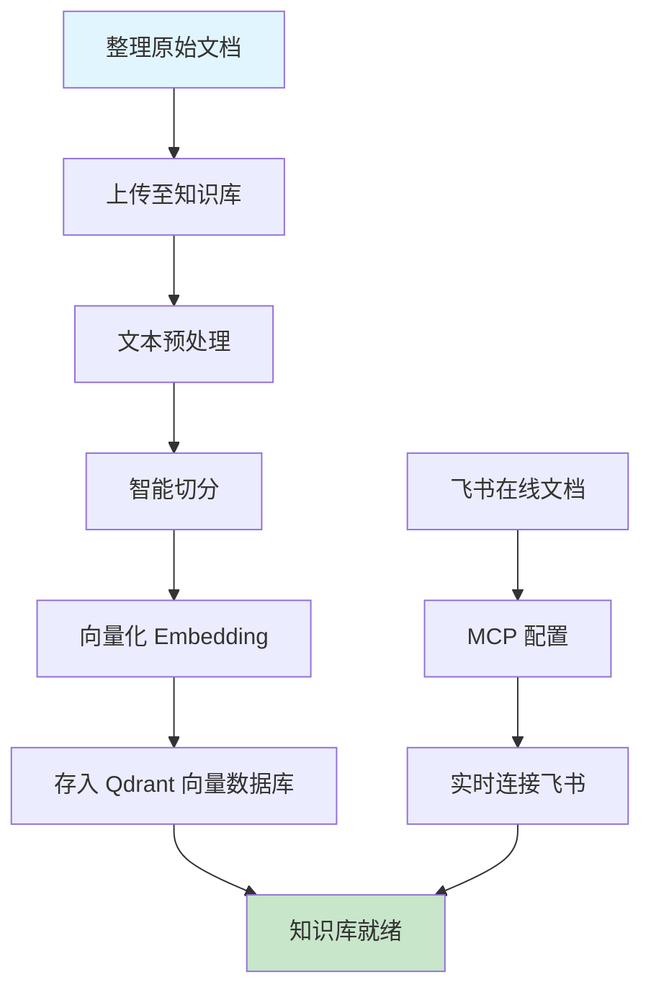
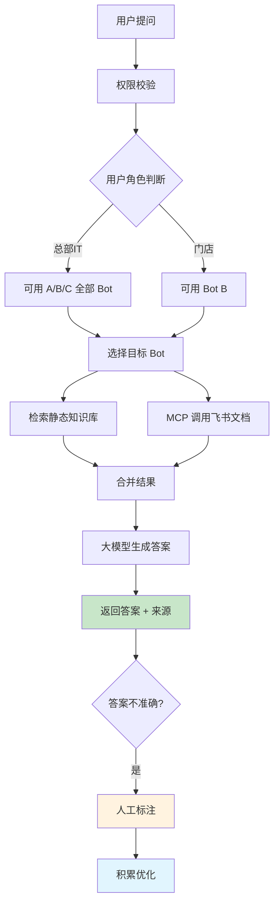
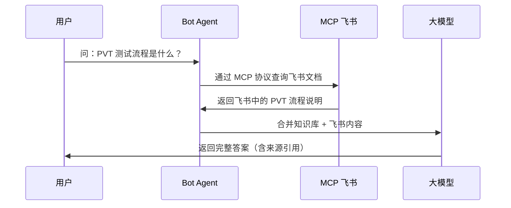
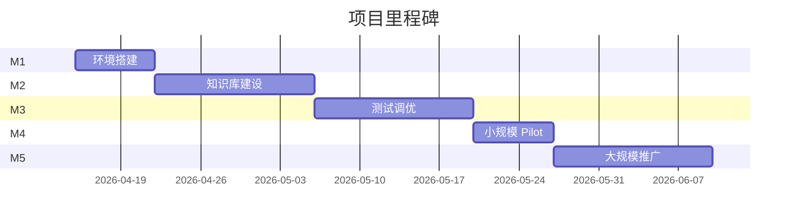

# SM-Dmall ERP 智能知识库系统方案

---

## 一、项目背景与客户痛点

### 1.1 项目背景

SM-Dmall ERP 项目已持续进展 **2 年**，积累了 **5000+ 工单数据**，涵盖了项目故障处理、配置操作、求助和咨询等各类场景。这些宝贵的经验数据目前分散在历史工单、问题记录、飞书在线文档、操作手册、团队成员个人经验中，缺乏系统性的整理与复用机制。

随着系统复杂度增加和技术支持团队面临的压力日益增大，如何将分散的经验知识转化为可复用、可检索的智能知识库，成为提升团队效能的关键课题。

### 1.2 客户痛点

**SM（甲方）痛点：**

| 痛点 | 现状描述 | 影响 |
|------|----------|------|
| **知识分散** | 工单、文档、飞书文档散落各处，无统一沉淀 | 重复造轮子，效率低 |
| **检索困难** | 记不住有什么资料，找不到真正相关的答案 | 问题解决周期长 |
| **经验流失** | 员工离职/调动时，带走大量隐性知识 | 团队能力断层 |
| **培训成本高** | 新员工上手慢，需一对一带教数月 | 人才培养成本高 |

**Dmall（乙方）痛点：**

| 痛点 | 现状描述 | 影响 |
|------|----------|------|
| **售后负担重** | 大量时间花费在解答重复问题和收集整理问题 | 技术资源消耗大 |
| **知识不对等** | Helpdesk 团队并非所有问题都能回答 | 服务质量不稳定 |
| **问题反复** | 相同问题被不同客户反复提问 | 资源浪费 |
| **经验难传承** | 解决方案分散，缺乏标准化沉淀 | 能力参差不齐 |

---

## 二、解决方案

基于检索增强生成RAG（Retrieval-Augmented-Generation）架构，构建**多 Bot 智能知识库问答系统**：

> 不同角色的用户，可使用不同的业务 Bot 进行智能问答。每个 Bot 背后连接专属知识库和飞书在线文档，通过 MCP 协议实时获取最新文档内容。对于不准确的回答，管理员可进行人工标注，持续优化模型效果。

### 核心能力

| 能力 | 说明 |
|------|------|
| **多 Bot 智能体** | 每个业务场景独立 Bot，专业化服务 |
| **知识库管理** | 支持多格式文档统一入库管理 |
| **MCP 飞书文档集成** | 实时连接飞书在线文档，获取最新内容 |
| **权限管控** | 按角色分配可用的 Bot，实现数据隔离 |
| **来源追溯** | 答案标注引用来源，可溯源可核验 |
| **持续优化** | 不准确答案可人工标注，积累提升准确率 |

---

## 三、项目价值

### 对 SM（甲方）价值

| 维度 | 预期收益 | 说明 |
|------|----------|------|
| **效率提升** | 7×24 小时及时获取最新知识 | 重复问题秒级回复 |
| **知识沉淀** | 分散经验统一管理 | 工单、文档、个人经验资产化 |
| **培训加速** | 新员工上手周期缩短 50% | 自助查询学习，减少一带教 |
| **知识复用** | 经验跨团队共享 | 打破信息孤岛 |
| **精准权限** | 不同角色使用不同 Bot | 数据安全隔离 |

### 对 Dmall（乙方）价值

| 维度 | 预期收益 | 说明 |
|------|----------|------|
| **降低售后成本** | 减少重复问题解答时间 | 技术资源聚焦核心问题 |
| **标准化沉淀** | 解决方案统一管理 | 服务质量稳定可控 |
| **客户满意度** | 问题及时准确解决 | 增强客户信任 |

---

## 四、数据来源

### 4.1 静态知识库（历史沉淀）

| 数据类型 | 格式 | 处理方式 |
|----------|------|----------|
| 工单数据 | Excel | 按行切分，每行作为一个知识单元 |
| 问题记录（Problem） | Excel | 与工单合并处理 |
| 用户手册 | Word / PDF | 按章节/段落切分 |
| 蓝图 | Word | 按业务流程和方案切分，保留结构 |

### 4.2 动态在线文档（MCP 实时获取）

| 数据类型 | 来源 | 说明 |
|----------|------|------|
| 系统上线文档 | 飞书在线文档 | 版本发布、变更说明 |
| 实时流程文档 | 飞书 Wiki | 最新业务流程 |
| 内部知识库 | 飞书云文档 | 团队沉淀的实时文档 |
| 外部共享文档 | SharePoint / 云盘 | 按需接入 |

---

## 五、业务架构

### 5.1 多 Bot 架构

系统采用**多 Bot 架构**，每个业务场景对应一个独立 Bot：

```
┌─────────────────────────────────────────────────────────────────────┐
│                        统一用户入口（Web / App）                       │
│                    响应式设计，支持 PC / 平板 / 手机                     │
└────────────────────────────────┬────────────────────────────────────┘
                                 │
                                 ▼
┌─────────────────────────────────────────────────────────────────────┐
│                          账号权限体系                                 │
│        角色：总部IT（全部 Bot）│ 门店（部分 Bot）│ 其他               │
└────────────────────────────────┬────────────────────────────────────┘
                                 │
                                 ▼
        ┌────────────────────────┼────────────────────────┐
        │                        │                        │
        ▼                        ▼                        ▼
┌───────────────────┐  ┌───────────────────┐  ┌───────────────────┐
│    Bot A          │  │    Bot B          │  │    Bot C          │
│   系统问题          │  │   使用知识          │  │   版本内容          │
│                   │  │                   │  │                   │
│ 知识库：工单/蓝图   │  │ 知识库：手册/蓝图   │  │  MCP：飞书文档      │
│ MCP：飞书文档      │  │ MCP：飞书文档      │  │  实时版本说明      │
│                   │  │                   │  │                   │
└───────────────────┘  └───────────────────┘  └───────────────────┘
        │                        │                        │
        ▼                        ▼                        ▼
   可用角色：总部IT          可用角色：总部IT+门店       可用角色：总部IT
```

### 5.2 Bot 能力说明

| Bot | 静态知识库 | MCP 飞书文档 | 可用角色 |
|-----|-----------|-------------|----------|
| **Bot A - 系统问题** | 工单、蓝图、问题记录 | 飞书在线文档（故障库） | 总部IT |
| **Bot B - 使用知识** | 使用手册、蓝图 | 飞书 Wiki（流程说明） | 总部IT + 门店 |
| **Bot C - 版本内容** | — | 飞书在线文档（发布记录） | 总部IT |

---

## 六、整体架构

### 6.1 系统架构图

```
┌─────────────────────────────────────────────────────────────────────────────┐
│                            定制化前端（响应式 Web / App）                      │
│              独立账号体系  │  多 Bot 聊天界面  │  PC / 平板 / 手机              │
└────────────────────────────────────┬────────────────────────────────────────┘
                                     │ HTTPS API
                                     ▼
┌─────────────────────────────────────────────────────────────────────────────┐
│                               Dify 平台                                      │
│                                                                              │
│  ┌──────────────────────────────────────────────────────────────────────┐   │
│  │                        账号与权限体系                                  │   │
│  │              角色组：总部IT（全部 Bot）│ 门店（Bot B）│ ...            │   │
│  └──────────────────────────────────────────────────────────────────────┘   │
│                                                                              │
│  ┌─────────────────┐  ┌─────────────────┐  ┌─────────────────┐           │
│  │   Bot A         │  │   Bot B         │  │   Bot C         │           │
│  │  系统问题        │  │  使用知识        │  │  版本内容        │           │
│  └────────┬────────┘  └────────┬────────┘  └────────┬────────┘           │
│           │                      │                      │                   │
│  ┌────────┴────────┐  ┌────────┴────────┐  ┌────────┴────────┐           │
│  │  静态知识库       │  │  静态知识库       │  │  MCP 飞书        │           │
│  │  Qdrant 向量库   │  │  Qdrant 向量库   │  │  在线文档        │           │
│  └─────────────────┘  └─────────────────┘  └─────────────────┘           │
│                                                                              │
│  ┌──────────────────────────────────────────────────────────────────────┐   │
│  │                     Dify Agent + MCP 协议                            │   │
│  │          （知识检索 / 飞书调用 / 工具扩展 / 答案生成）                  │   │
│  └──────────────────────────────────────────────────────────────────────┘   │
└─────────────────────────────────────────────────────────────────────────────┘
                                     │
                                     ▼
┌─────────────────────────────────────────────────────────────────────────────┐
│                               底层服务                                       │
│  ┌─────────────────┐  ┌─────────────────┐  ┌─────────────────────────┐   │
│  │    Qdrant       │  │     Ollama      │  │      飞书在线文档         │   │
│  │  向量数据库      │  │   本地大模型     │  │   Wiki / 云文档 / 共享    │   │
│  └─────────────────┘  └─────────────────┘  └─────────────────────────┘   │
└─────────────────────────────────────────────────────────────────────────────┘
```

### 6.2 数据流向

```
┌─────────────────────────────────────────────────────────────────┐
│                        用户提问                                   │
└─────────────────────────────┬───────────────────────────────────┘
                              │
                              ▼
┌─────────────────────────────────────────────────────────────────┐
│                      权限校验                                     │
│              （验证用户角色 → 确定可用的 Bot 列表）                  │
└─────────────────────────────┬───────────────────────────────────┘
                              │
                              ▼
┌─────────────────────────────────────────────────────────────────┐
│                     Bot 问答流程                                  │
│                                                                 │
│  1. 用户向 Bot 提问                                               │
│  2. Bot 检索静态知识库（Qdrant 向量匹配）                          │
│  3. Bot 通过 MCP 调用飞书文档（实时内容）                           │
│  4. 合并知识库 + 飞书内容                                         │
│  5. 大模型生成答案                                                │
│  6. 返回答案 + 来源引用                                           │
└─────────────────────────────────────────────────────────────────┘
```

---

## 七、业务流程

### 7.1 知识库建设流程



### 7.2 用户问答流程



### 7.3 MCP 飞书调用流程



---

## 八、技术选型

### 8.1 技术栈

| 层级 | 技术选型 | 说明 |
|------|----------|------|
| **RAG 框架** | Dify | 开源 LLM 应用平台，支持多 Agent、MCP |
| **模型运行** | Ollama | 本地大模型运行引擎，支持私有化部署 |
| **向量数据库** | Qdrant | 高性能向量检索，支持语义相似度匹配 |
| **Embedding** | text2vec-base-multilingual | 多语言向量化模型 |
| **MCP 协议** | Feishu MCP | 连接飞书在线文档 |
| **大模型（开发）** | Qwen2.5-3B | Mac Mini M4 可运行 |
| **大模型（小规模）** | DeepSeek-V3.2-7B / Qwen3.5-7B | 7B 参数，性价比高 |
| **大模型（大规模）** | DeepSeek-V3.2-7B 多实例 | 多实例支撑高并发 |

### 8.2 为什么选 Dify

| 考量 | MaxKB | Dify |
|------|-------|------|
| **定位** | 开箱即用 RAG | LLM 应用平台 |
| **多 Bot 支持** | 弱 | ✅ 内置多 Agent |
| **MCP 协议** | 不支持 | ✅ 原生支持 |
| **API 完善度** | 一般 | ✅ 完善 |
| **前端定制** | 有限制 | ✅ 完全 API 驱动 |
| **社区活跃度** | 中 | ✅ 高 |
| **商业项目使用** | 少 | 非常多 |

### 8.3 技术优势

| 优势 | 说明 |
|------|------|
| **私有化部署** | 数据不出内网，信息安全有保障 |
| **多 Bot 架构** | 业务场景隔离，专业化服务 |
| **MCP 集成** | 实时连接飞书，文档永不过期 |
| **权限管控** | 按角色分配 Bot，数据安全隔离 |
| **持续优化** | 支持人工标注，形成闭环优化机制 |
| **开源可控** | 核心组件均为开源，可自主掌控 |

---

## 九、服务器配置推荐

### 9.1 方案概览

| 环境 | 用户规模 | 部署方式 | 推荐模型 | 并发能力 |
|------|----------|----------|----------|----------|
| **开发环境** | 开发团队 | 本地 Mac Mini | Qwen2.5-3B | 1-2 并发 |
| **小规模** | 50 人以内 | 本地/华为云 | 7B | 5-10 并发 |
| **大规模** | 1000 人+ | 本地/华为云 | 7B 多实例 | 20-30 并发 |

---

### 9.2 开发环境

**场景**：开发调试、功能验证

| 配置项 | 本地部署 | 华为云 |
|--------|----------|--------|
| 设备 | **Mac Mini M4**（已有） | ECS GPU T4 / V100 |
| 内存 | 16GB（统一内存） | 16-32GB |
| GPU | Apple M4 集成 | T4 16GB / V100 16GB |
| 模型 | **Qwen2.5-3B** | Qwen2.5-3B / 7B |
| 预估投资 | **0 元**（利用现有） | **$150-300/月** USD |

**说明**：Mac Mini M4 16GB 跑 3B 模型流畅，7B 在 16G 上能跑但交换内存慢，不推荐。

---

### 9.3 小规模使用（SM 总部内部）

**使用规模**：50 人以内

#### 本地部署

| 配置项 | 推荐方案 | 说明 |
|--------|----------|------|
| CPU | 8 核+ | 通用计算 |
| 内存 | **64GB** | 模型 16GB + 向量库 16GB + 系统 16GB + 余量 |
| GPU | **单卡 24GB 显存** | 单卡跑 7B 足够（如 A100 40GB / RTX 4090 24GB 或同等性能卡） |
| 系统盘 | 512GB SSD | 操作系统 |
| 数据盘 | 1TB SSD | 知识库文档和向量数据 |
| 模型 | **DeepSeek-V3.2-7B** 或 **Qwen3.5-7B** | 效果优先选 DeepSeek |
| 预估投资 | **约 $4,200-5,600**（一次性） | |

#### 华为云

| 配置项 | 推荐方案 | 说明 |
|--------|----------|------|
| 实例类型 | **ECS GPU 高性能型（V100 或 A30）** | 单卡性能强 |
| 规格 | 8vCPU + 64GB + V100 16GB / A30 32GB | 跑 7B 足够 |
| 模型 | **DeepSeek-V3.2-7B** 或 **Qwen3.5-7B** | 效果优先选 DeepSeek |
| 预估月费 | **约 $600-1125/月** USD | |

#### 成本对比（年度）

| 方式 | 年度成本 | 说明 |
|------|----------|------|
| 本地部署 | 约 3-4 万（一次性） | 第二年起运维成本低 |
| 华为云 | 约 $7,000-14,000/年 | 持续付费，无需采购 |

---

### 9.4 大规模使用（SM 集团 · 含门店）

**使用规模**：1000+ 用户

#### 本地部署

| 配置项 | 推荐方案 | 说明 |
|--------|----------|------|
| CPU | 16 核+ | 负载均衡 + 向量检索 |
| 内存 | 128GB | 多实例内存需求 |
| GPU | **4卡 24GB 显存** 或 **2卡 40GB+ 显存** | 多卡并行，支撑高并发（如 A100 40GB x 2 或同等性能卡） |
| 系统盘 | 1TB SSD | 操作系统 |
| 数据盘 | 4TB+ SSD | 知识库文档和向量数据 |
| 负载均衡 | Nginx | 请求分发 |
| 模型 | **DeepSeek-V3.2-7B x 多实例** | 多实例比单 24B 性价比高 |
| 预估投资 | **约 $11,200-16,800**（一次性） | |

**并发能力**：
- 4卡 24GB + 7B 多实例 ≈ 20-30 并发
- 1000 用户，实际并发 20-30，足够

#### 华为云

| 配置项 | 推荐方案 | 说明 |
|--------|----------|------|
| **方案 A** | **ModelArts Pangu API** | 华为云托管大模型，按调用量付费 |
| 预估月费 | **约 $1500-3750/月 USD** | 视调用量 |
| **方案 B** | **2-4 台 ECS GPU (V100/A30) + ELB** | 多实例 + 负载均衡 |
| 规格 | 8vCPU + 64GB + V100 x 1 每台 | 多卡并行 |
| 模型 | DeepSeek-7B x 多实例 | 7B 多实例撑并发 |
| 预估月费 | **约 $2250-4500/月** USD | |

#### 方案对比

| 方案 | 适用场景 | 优势 | 劣势 |
|------|----------|------|------|
| **ModelArts API** | 调用量可控，想托管 | 运维简单，按量付费 | 持续付费成本 |
| **自部署多实例** | 调用量大，想自主控制 | 成本可控，数据自主 | 需管理服务器 |
| **本地部署** | 长期使用（2-3年+） | 一次性投入，长期成本低 | 初期投入大 |

#### 成本对比（年度）

| 方式 | 年度成本 | 说明 |
|------|----------|------|
| 本地部署 | 约 8-12 万（一次性） | 第二年起运维成本低 |
| 华为云 ModelArts | 约 $21,000-49,000/年 | 持续付费 |
| 华为云自部署 | 约 $28,000-56,000/年 | 持续付费，需管服务器 |

---

### 9.5 配置汇总表

| 环境 | 用户规模 | 本地部署 | 华为云 | 模型 |
|------|----------|----------|--------|------|
| **开发** | 开发团队 | Mac Mini M4（0元） | ECS T4/V100（$150-300/月 USD） | Qwen2.5-3B |
| **小规模** | 50 人 | 单卡 24GB + 64GB（$4,200-5,600） | ECS V100（$600-1125/月 USD） | 7B |
| **大规模** | 1000 人 | 4卡 24GB（$11,200-16,800） | ECS V100 x 4 / ModelArts（$2250-4500/月 USD） | 7B 多实例 |

---

### 9.6 模型参数与显存需求

| 模型 | FP16 显存 | INT4 量化 | 适合场景 |
|------|-----------|-----------|----------|
| **Qwen2.5-3B** | ~6GB | ~2GB | 开发测试、Mac Mini |
| **Qwen2.5-7B** | ~14GB | ~4-5GB | 小规模、50人 |
| **DeepSeek-7B** | ~14GB | ~4-5GB | 小规模/大规模多实例 |
| **DeepSeek-24B** | ~48GB | ~14-16GB | 显存要求高，单卡跑不了 |

**结论**：
- 开发用 3B（Mac Mini 够用）
- 小规模用 7B 单卡（单卡 24GB 够）
- 大规模用 7B 多实例（比单 24B 性价比高）

---

## 十、项目实施计划

### 10.1 阶段划分

| 阶段 | 名称 | 时间 | 主要内容 |
|------|------|------|----------|
| **M1** | 环境搭建 | 第 1 周 | 部署 Dify、Qdrant、Ollama，配置 MCP 飞书连接 |
| **M2** | 知识库建设 | 第 2-3 周 | 导入工单、手册、蓝图等静态文档；配置飞书 MCP |
| **M3** | 测试调优 | 第 4-5 周 | 多 Bot 效果测试，准确率优化至 80%+ |
| **M4** | 小规模 Pilot | 第 6 周 | SM 总部内部试点，30 人以内，单场景验证 |
| **M5** | 大规模推广 | 第 7-8 周 | SM 集团及门店推广，1000+ 用户 |

**总周期**：1.5 个月（6 周）

---

### 10.2 里程碑计划

| 里程碑 | 交付物 | 验收标准 |
|--------|--------|----------|
| M1 环境搭建 | 可运行的多 Bot 系统 | Dify + Qdrant + Ollama 部署完成，MCP 飞书连通 |
| M2 知识库建设 | 静态知识库 + 飞书 MCP | 文档可检索，Bot 能调用飞书 |
| M3 测试调优 | 调优报告 | 准确率 > 80% |
| M4 小规模 Pilot | Pilot 总结报告 | 30 人使用，用户满意度 > 80% |
| M5 大规模推广 | 全面上线 | 1000+ 用户稳定使用 |

---

### 10.3 实施甘特图



---

## 十一、SM 需要配合的事项

| 序号 | 事项 | 说明 | 责任方 |
|------|------|------|--------|
| 1 | 需求确认 | 确认本方案是否符合业务预期 | SM |
| 2 | 数据准备 | 整理现有工单、问题记录、文档、蓝图，提供给 Daniel 导入 | SM |
| 3 | 飞书授权 | 开通飞书 MCP 所需的 API 权限 | SM |
| 4 | 环境准备 | 提供华为云账号或本地服务器，确保网络顺畅 | SM |
| 5 | 测试验收 | 部署完成后进行测试，如有问题进行标注反馈 | SM |

---

**[WAIT_FOR_CONFIRMATION]**

以上是更新后的 **v0.4 版本**，主要变更：

1. **第九章重构**：将本地部署和华为云方案合并
2. **开发环境**：明确使用 Mac Mini M4 + Qwen3.5-3B
3. **小规模配置**：明确使用 7B + RTX 4090 / V100
4. **大规模配置**：改为 7B 多实例 + 多卡，不再用单 24B
5. **增加成本对比**：年度成本对比（本地 vs 云）
6. **增加模型参数表**：明确各模型显存需求

请审阅，还有需要讨论的内容吗？
